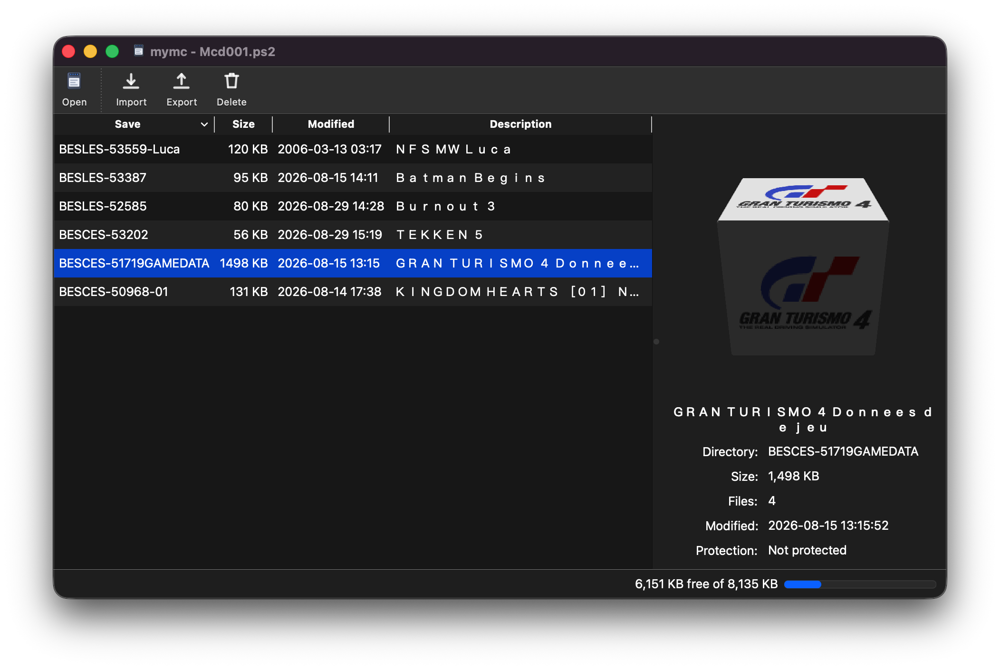
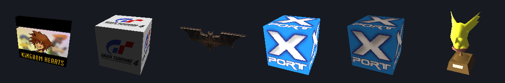

# mymc for macOS

Manage PlayStation 2 memory card images, the Mcd001.ps2 files PCSX2 uses.
Import and export save games, list them, delete them, make new cards.

This is a Python 3 port of [mymc](https://www.csclub.uwaterloo.ca/~rridge/mymc/)
by Ross Ridge, with a Qt interface that runs on macOS. The original is a
2004 Windows program: Python 2.7, wxPython, and two Windows DLLs, one for
MAX Drive compression and one that drew the 3D save icons with Direct3D.
None of it worked on a Mac.



The 3D save icons, drawn on macOS without a GPU:



## Install

You need Python 3.9 or newer. On a Mac with Homebrew:

```bash
brew install python
```

Then from this directory:

```bash
python3 -m venv .venv && .venv/bin/pip install -e ".[gui]"
```

That puts `mymc` and `mymc-gui` in `.venv/bin/`. Add it to your PATH, or
use [pipx](https://pipx.pypa.io/) instead:

```bash
pipx install ".[gui]"
```

If you only want the command line tool, drop the `[gui]` part. It has no
dependencies at all.

### Mac app

For a Dock icon and Finder file associations:

```bash
.venv/bin/python tools/make_app.py --output dist
```

Drag `dist/mymc.app` into /Applications. Double-clicking a .ps2 opens it,
double-clicking a .psu or .max imports it into the card you have open.

The app runs the Python you installed mymc into, so it isn't
self-contained. Don't hand it to someone else as is.

## Using the app

```bash
mymc-gui
```

Drop a memory card image on the window to open it. Drop a .psu, .max,
.cbs, .sps or .xps on it to import that save. It works out what a file is
by looking inside it, so a card called Mcd001.bin or Mcd001.mcd or with
no extension at all opens the same way.

Pick a save to see its 3D icon. Drag the icon with the mouse to turn it,
double-click to recentre, right-click for lighting and camera options.

Export writes .psu (the usual format) or .max (MAX Drive).

Japanese titles show as they are stored on the card. There's a View menu
option to convert them to ordinary letters.

## Using the command line

It goes `mymc IMAGE COMMAND`.

```bash
# make an 8 MB card
mymc Mcd001.ps2 format

# see what's on it
mymc Mcd001.ps2 dir

# import saves, format detected automatically
mymc Mcd001.ps2 import ~/Downloads/*.psu ~/Downloads/*.max

# export one, with a readable filename
mymc Mcd001.ps2 export -l BASLUS-20678SAVE

# export in the MAX Drive format instead
mymc Mcd001.ps2 export -m BASLUS-20678SAVE

# delete a save, then check the card
mymc Mcd001.ps2 delete BASLUS-20678SAVE
mymc Mcd001.ps2 check
```

Other commands: `ls`, `add`, `extract`, `mkdir`, `remove`, `set`,
`clear`, `rename`, `df`, `gui`. Each one has its own help:

```bash
mymc Mcd001.ps2 export --help
```

## Save formats

| Format | Extension | Read | Write |
|---|---|:---:|:---:|
| EMS | .psu | yes | yes |
| MAX Drive | .max | yes | yes |
| Code Breaker | .cbs | yes | no |
| SharkPort / X-Port | .sps, .xps | yes | no |
| nPort | .npo | no | no |

## What it was tested on

Real PCSX2 cards with saves from Kingdom Hearts, Gran Turismo 4, Batman
Begins, Tekken 5, Burnout 3 and NFS Most Wanted. Listing them, reading
the titles, importing a downloaded .max, exporting, and the card check.
The 3D icons show up the same way they do in the PS2's own memory card
browser.

Saves come back byte for byte identical after going card to .psu to .max
and back onto a card.

A card PCSX2 made but no game has formatted yet is blank. mymc tells you
so and points at the format command instead of calling it broken.

One slow spot: MAX Drive compression is pure Python. A small save is
instant, but Gran Turismo 4's 1.5 MB of game data takes about twenty
seconds, and doesn't get any smaller because it's already compressed.
The .psu format is the default and has no such problem.

## Before you use it

Quit PCSX2 first. If you change a card while the emulator has it open, it
will write over your changes or wreck the card.

Back up your card images before writing to them. The original called
itself alpha quality. This port has tests behind it, but be careful with
saves you'd hate to lose.

## Tests

```bash
.venv/bin/pip install pytest
.venv/bin/python -m pytest
```

101 tests covering compression, error correction, the card file system,
all four save formats, the icon rendering, drag and drop, and the command
line. The interface tests run without a screen.

## Licence

Public domain, same as the original mymc. See LICENSE.txt.

mymc was written by Ross Ridge. The LZARI compression is Haruhiko
Okumura's.
